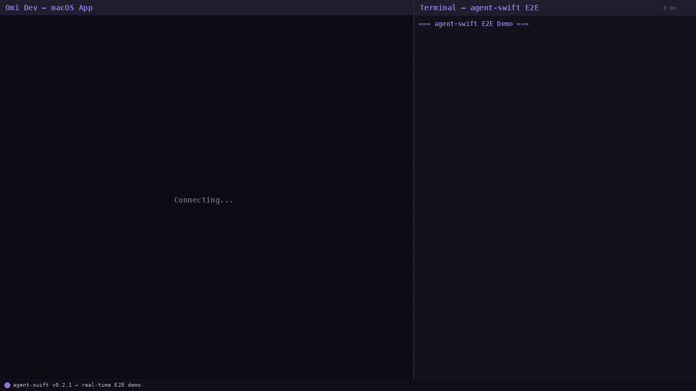

# agent-swift

Native Swift CLI for AI agents to control macOS apps through the Accessibility API.

`agent-swift` gives Claude, GPT, and other agents one interface to automate native macOS UI: inspect elements, click buttons, fill fields, take screenshots, assert conditions, and wait for state changes.

Version: `0.2.1`



## Install

### Homebrew (recommended)

```bash
brew install beastoin/tap/agent-swift
```

### Shell script

```bash
curl -fsSL https://raw.githubusercontent.com/beastoin/agent-swift/main/install.sh | sh
```

### Build from source

```bash
git clone https://github.com/beastoin/agent-swift.git
cd agent-swift
swift build -c release
cp .build/release/agent-swift /usr/local/bin/
```

## Prerequisites

1. macOS 13+
2. Accessibility permission for your terminal/agent process (System Settings > Privacy & Security > Accessibility)
3. Target app is running

## Quick Start

```bash
# 1) Verify host readiness
agent-swift doctor

# 2) Connect to an app
agent-swift connect --bundle-id com.apple.TextEdit

# 3) Capture refs
agent-swift snapshot -i

# 4) Interact
agent-swift press @e1
agent-swift fill @e2 "hello"

# 5) Verify state and capture evidence
agent-swift is exists @e1
agent-swift screenshot /tmp/agent-swift.png

# 6) Disconnect
agent-swift disconnect
```

## Commands (15)

| Command | Description | Example |
|---|---|---|
| `doctor` | Check prerequisites and connection health | `agent-swift doctor` |
| `connect` | Connect by PID or bundle ID | `agent-swift connect --bundle-id com.apple.TextEdit` |
| `disconnect` | Clear session | `agent-swift disconnect` |
| `status` | Show current session and refs count | `agent-swift status` |
| `snapshot` | Capture AX tree and generate `@eN` refs | `agent-swift snapshot -i` |
| `press` | Press element by ref (`AXPress`, fallback to click) | `agent-swift press @e3` |
| `click` | Direct CGEvent click by ref or coordinates | `agent-swift click @e3` / `agent-swift click 640 420` |
| `fill` | Set text value on element | `agent-swift fill @e2 "Draft title"` |
| `get` | Read `text`, `type`, `role`, `identifier`, or `attrs` | `agent-swift get text @e2` |
| `find` | Locate by `role`, `text`, or `identifier`; optional chained action | `agent-swift find text Save press` |
| `screenshot` | Capture app window screenshot | `agent-swift screenshot /tmp/app.png` |
| `is` | Assertion command (`exists`, `visible`, `enabled`, `focused`) | `agent-swift is enabled @e4` |
| `wait` | Wait for condition (`exists`, `visible`, `text`, `gone`) or delay ms | `agent-swift wait text "Saved" --timeout 8000` |
| `scroll` | Scroll direction (`up/down`) or scroll ref into view | `agent-swift scroll down --amount 8` |
| `schema` | Output machine-readable command schema | `agent-swift schema` |

### Global flags

| Flag | Description |
|---|---|
| `--json` | Force JSON output |
| `--help` | Show help |

## Snapshot format

```text
@e1 [button] "Save"  identifier=saveButton
@e2 [textfield] "Name"
@e3 [label] "Ready"
```

- Refs are sequential per snapshot (`@e1`, `@e2`, ...) and reset on each `snapshot` call.
- Re-run `snapshot` after UI-changing commands (`press`, `click`, `fill`, `scroll`) — refs may shift.
- `snapshot --json` returns objects with `ref`, `type`, `label`, `role`, `identifier`, `enabled`, `focused`, `bounds`.
- `snapshot -i` filters to interactive elements only.

## JSON output

JSON is enabled when:

- You pass `--json`
- `AGENT_SWIFT_JSON=1`
- stdout is non-interactive (non-TTY)

Examples:

```bash
agent-swift status --json
agent-swift snapshot -i --json
agent-swift find text Save press --json
```

`status --json`:

```json
{
  "bundleId": "com.apple.TextEdit",
  "connected": true,
  "connectedAt": "2026-03-09T00:00:00Z",
  "pid": 12345,
  "refs": 12
}
```

`snapshot -i --json`:

```json
[
  {
    "bounds": {"x": 400, "y": 220, "width": 80, "height": 30},
    "enabled": true,
    "focused": false,
    "identifier": "saveButton",
    "label": "Save",
    "ref": "e1",
    "role": "AXButton",
    "type": "button"
  }
]
```

Error shape (JSON mode):

```json
{
  "error": {
    "code": "NOT_CONNECTED",
    "diagnosticId": "a3f2b1c0",
    "hint": "Run: agent-swift connect --bundle-id <id>",
    "message": "No active session"
  }
}
```

## Environment variables

| Variable | Purpose | Default |
|---|---|---|
| `AGENT_SWIFT_JSON` | JSON output mode (`1`) | unset |
| `AGENT_SWIFT_TIMEOUT` | Default `wait` timeout (ms) | `5000` |
| `AGENT_SWIFT_HOME` | Session directory path | `~/.agent-swift` |

Precedence: CLI flag > env var > built-in default.

## Exit codes

| Code | Meaning |
|---|---|
| `0` | Success |
| `1` | Assertion false (`is` command only) |
| `2` | Error |

## Development

This repo is the **publish target**. Source of truth is [`beastoin/autoloop`](https://github.com/beastoin/autoloop) — all code changes go through autoloop's phase-gated build loop (program → implement → eval → keep/revert), then get copied here for release.

Do not edit this repo directly. To make changes, add a new phase program in autoloop.

```bash
# For local testing only
git clone https://github.com/beastoin/agent-swift.git
cd agent-swift
swift build
swift test
swift build -c release --arch arm64 --arch x86_64  # universal binary
```

## Related tools

| Tool | Platform | Transport |
|---|---|---|
| `agent-swift` | Native macOS apps | Accessibility API (`AXUIElement`) |
| [`agent-flutter`](https://github.com/beastoin/agent-flutter) | Flutter apps | Dart VM Service + Marionette |
| [`autoloop`](https://github.com/beastoin/autoloop) | Build system | Phase-gated eval loops |

All share the same `snapshot → @ref → press/fill/wait/is` workflow.

## Agent integration

See [AGENTS.md](AGENTS.md) for the full AI-agent integration guide.

## License

MIT
